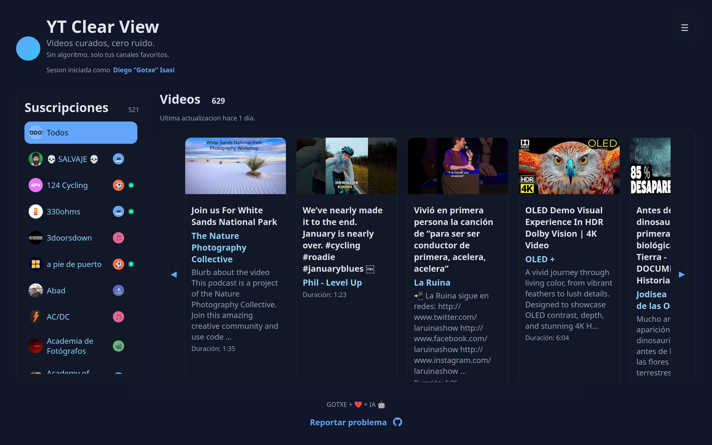

# W.I.P.

[Read this in Spanish →](README_ES.md)

# YT Clear View

Curated YT viewing without the recommendation algorithm.

## Screenshots



## Features

- Flask REST API with SQLite persistence
- Separate log viewer microservice
- Vanilla HTML/CSS/JS frontend
- Device detection and responsive layout
- Dark-by-default theme with persistence
- Infinite carousel for videos
- UI localization (EN/ES) with external JSON dictionaries
- YT Data API v3 integration
- HTTPS-only deployment behind reverse proxy

### Automatic Channel Categorization (NEW)

- **14+ Categories**: Gaming, Technology, Education, Music, Food, Fitness, Travel, Fashion, News, Entertainment, Vlogs, Sports, Art, Science
- **Multi-Method Classification**: 4 methods in cascade (YT Topics, TF-IDF, Hybrid Semantic, Ollama LLM)
- **Manual Override**: Reassign any channel to a different category
- **Category Carousels**: Browse videos organized by content type
- **Color-Coded Categories**: Each category has its own distinctive color

### Channel Rating System (NEW)

- **5-Star Rating**: Rate your subscribed channels from 1 to 5 stars
- **Filter by Rating**: Find your favorite channels quickly
- **Personal Ratings**: Each user maintains their own channel ratings

## Quick Start (Development)

```bash
python3 -m venv .venv
source .venv/bin/activate
pip install -r backend/requirements.txt
```

Create `backend/.env` from `backend/.env.example`, then run:

```bash
cd backend
python -m flask --app app run --port 5550
```

Or use the helper script:

```bash
./scripts/run_local.sh
```

The script starts:
- Backend at `http://localhost:5550`
- Frontend at `http://localhost:8080`
- Log viewer at `http://localhost:5551/logs` (default `admin/admin` if not set in `.env`)

## Production (simple)

Use a separate script for production:

```bash
./scripts/run_prod.sh
```

Notes:
- Use a real web server (nginx) to serve `frontend/`.
- Make sure `backend/.env` has your production URLs and OAuth values.

## Google Cloud setup (required)

You need a Google Cloud project with YouTube Data API v3 enabled and OAuth credentials for login.

Steps (short and simple):
1. Go to the Google Cloud Console: `https://console.cloud.google.com`
2. Create or select a project.
3. Enable **YouTube Data API v3**.
4. Configure the OAuth consent screen (app name + support email).
5. Create OAuth client credentials (type: **Web application**).
6. Set **Authorized JavaScript origins** and **Authorized redirect URIs** to match your local or server URLs.

In `backend/.env` (see `backend/.env.example`) set:
- `GOOGLE_CLIENT_ID`
- `GOOGLE_CLIENT_SECRET`
- `GOOGLE_REDIRECT_URI`

## Local URLs and config

If you run locally, these must match your environment:
- `backend/.env` contains the backend URL and OAuth redirect.
- `frontend/config.js` defines where the frontend calls the API and log viewer.

If you change ports or hostnames, update both files so:
- The frontend points to the right backend/log viewer.
- The Google OAuth redirect URL matches the backend redirect you set.

## Documentation

- API reference: `docs/api-reference.md`
- Architecture: `docs/architecture.md`
- Deployment: `docs/deployment.md`
- Development: `docs/development.md`

## License

MIT. See `LICENSE`.
