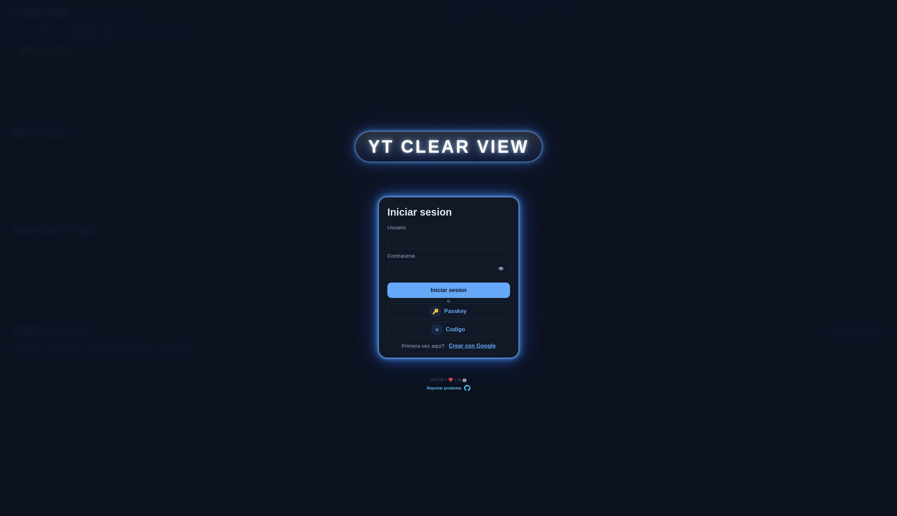
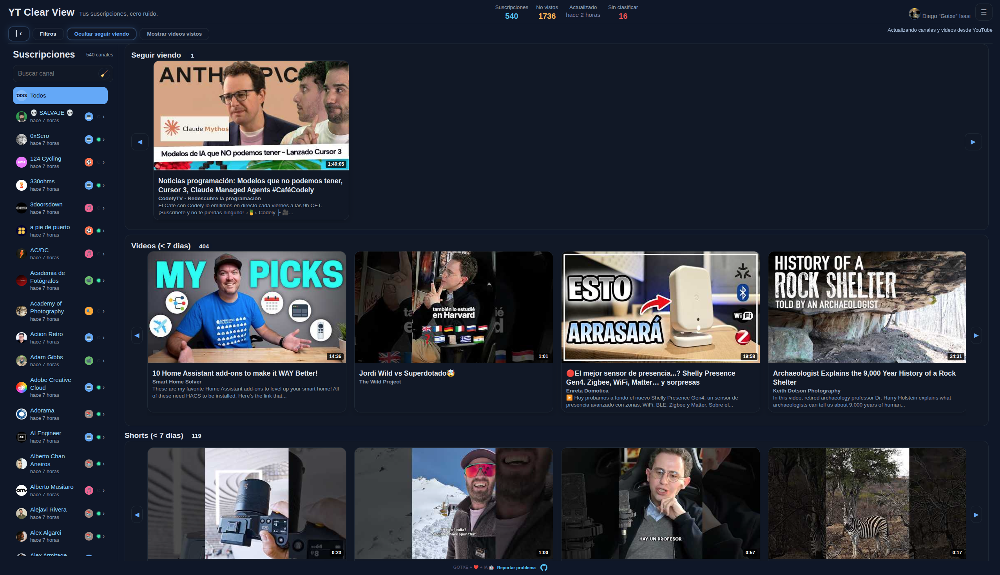
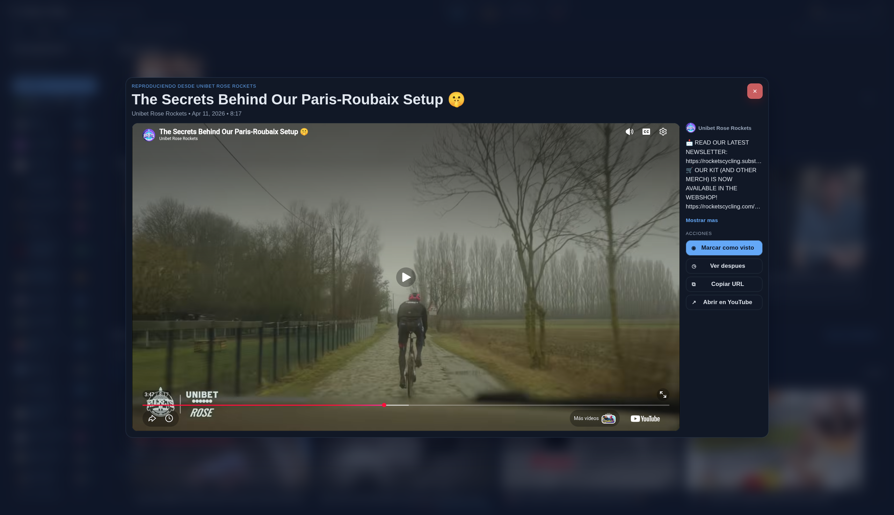
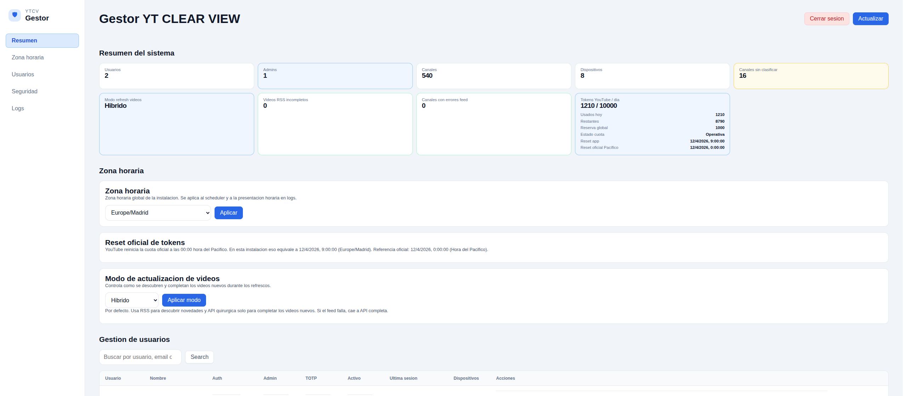
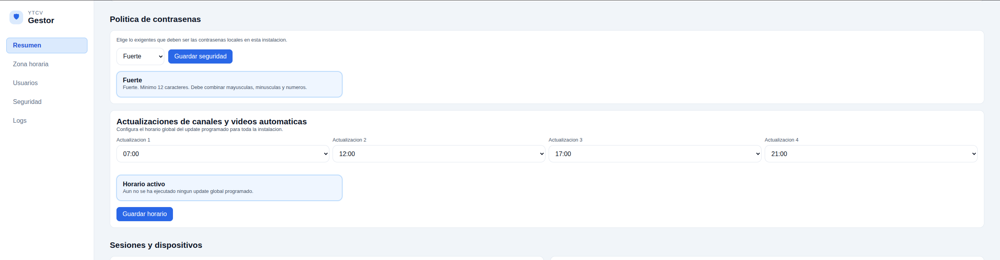
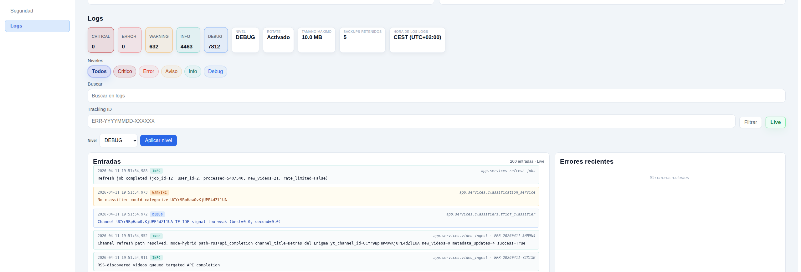

# YT Clear View (YTCV)

---

<p align="center">
  <a href="https://github.com/gotxe/youtube-clear-view/releases/tag/v0.13.0-beta.4"></a>
  <a href="#uso"></a>
  <a href="LICENSE"></a>
</p>
<p align="center">
  <a href="https://www.python.org/"></a>
  <a href="https://flask.palletsprojects.com/"></a>
  <a href="https://www.sqlalchemy.org/"></a>
  <a href="https://www.sqlite.org/"></a>
  <a href="https://gunicorn.org/"></a>
  <a href="https://caddyserver.com/"></a>
</p>
<p align="center">
  <a href="https://developers.google.com/youtube/v3"></a>
  <a href="https://developers.google.com/identity/protocols/oauth2"></a>
  <a href="https://developer.mozilla.org/docs/Web/JavaScript"></a>
  <a href="https://developer.mozilla.org/docs/Web/HTML"></a>
  <a href="https://developer.mozilla.org/docs/Web/CSS"></a>
</p>

---

[Read in English](README.md)

Tus Canales de YouTube, cero ruido 🎯

¡Hey! Soy GOTXE 👋, te cuento sobre YTCV, nació de algo muy simple:
yo entraba a YouTube con una misión clara... y acababa en cualquier sitio 😅

No es que eso esté mal. Siempre está bien descubrir cosas nuevas. 
Pero muchas veces yo quería justo lo contrario: abrir, ver mis suscripciones, ponerme al día y seguir con mi vida 🚀

Así que me monté esta app para mí, y ahora la comparto contigo por si te pasa lo mismo.

YTCV es un visor autoalojado para ver **solo** lo que te importa:
tus suscripciones, en orden cronológico, con una experiencia limpia, directa y sin rodeos ✨


Y no olvides que el verdadero enemigo no es el algoritmo, sino la procrastinación. ¡Tú tienes el control! 💪

> [!IMPORTANT] IMPORTANTE
Sin duda no te olvides de los Youtubers que tanto te gustan, recuerda que ellos también necesitan tu apoyo directo (suscripciones, likes, comentarios, merch, etc.) para seguir creando contenido de calidad. Utiliza también la app oficial de YouTube para eso, y apoya a tus creadores favoritos. El apoyo directo a los creadores es fundamental para que sigan creando contenido increíble.

## Índice

- [¿Qué hace YTCV?](#qué-hace-ytcv)
- [Capturas](#capturas)
- [Uso](#uso)
- [Primer acceso (flujo recomendado)](#primer-acceso-flujo-recomendado)
- [Login desde otros dispositivos (passkey o código)](#login-desde-otros-dispositivos-passkey-o-código)
- [OAuth sin dolores de cabeza](#oauth-sin-dolores-de-cabeza)
- [Solución de problemas](#solución-de-problemas)
- [Documentación](#documentación)
- [Soporte](#soporte)
- [Aviso legal](#aviso-legal)
- [Licencia](#licencia)

## ¿Qué hace YTCV?

- Importa tus suscripciones con Google OAuth + YouTube Data API v3.
- Te enseña los videos en orden cronológico real (como debe ser 🫡).
- Te deja filtrar por vistos/no vistos y organizar por categorías.
- Tras el primer acceso con Google, harás tu usuario de la bbdd local, para conectar desde cualquier dipositivo con ese usuario, sin utilizar más el de google.
- Corre en contenedores (backend + proxy), ideal para self-hosting.

## Capturas

### App principal





### Gestor





## Uso

La forma recomendada es con Docker Compose.

Modos de almacenamiento (elige uno):

1. Volúmenes nombrados de Docker (sin gestionar carpetas en host)
- No necesitas crear carpetas en el host.
- El compose usa volúmenes gestionados por Docker (`ytcv_data`, `ytcv_logs`).

2. Carpetas persistentes en host (recomendado en Synology)
- Crea carpetas en el host, por ejemplo:

```text
/volume1/docker/ytclearview/
  ├─ data/
  └─ logs/
```

- Luego móntalas como bind mounts en compose:

```yaml
services:
  backend:
    volumes:
      - /volume1/docker/ytclearview/data:/data
      - /volume1/docker/ytclearview/logs:/logs
```

Release e imágenes:
- Release: `v0.13.0-beta.4` -> <https://github.com/gotxe/youtube-clear-view/releases/tag/v0.13.0-beta.4>
- Imagen backend: <https://github.com/gotxe/youtube-clear-view/pkgs/container/ytcv-backend>
- Imagen proxy: <https://github.com/gotxe/youtube-clear-view/pkgs/container/ytcv-proxy>
- Ejemplo de pull:
```bash
docker pull ghcr.io/gotxe/ytcv-backend:v0.13.0-beta.4
docker pull ghcr.io/gotxe/ytcv-proxy:v0.13.0-beta.4
```

### 1) Prepara Google Cloud (búsquedas rápidas)

Antes de levantar YTCV, prepara esto en Google Cloud. Te dejo búsquedas directas:

- Crear proyecto en Google Cloud Console:
  - https://www.google.com/search?q=crear+proyecto+google+cloud+console
- Habilitar YouTube Data API v3:
  - https://www.google.com/search?q=habilitar+youtube+data+api+v3+google+cloud
- Crear credenciales OAuth 2.0 para app web:
  - https://www.google.com/search?q=crear+oauth+client+id+aplicacion+web+google+cloud
- Configurar pantalla de consentimiento OAuth:
  - https://www.google.com/search?q=configurar+oauth+consent+screen+google+cloud
- Configurar login en dispositivo (Device Authorization / Device Flow):
  - https://www.google.com/search?q=google+oauth+2.0+device+authorization+grant

### 2) Instalación estándar (uso normal)

Sin build local, tirando de imágenes en GHCR.

#### Paso A: prepara tu `.env`

Plantillas:
- [backend/.env.prod.example](backend/.env.prod.example)
- [backend/.env.dev.example](backend/.env.dev.example)

Tienes dos formas:

1. Si **clonaste el repo completo**:

```bash
cp backend/.env.prod.example backend/.env
```

2. Si **NO clonaste el repo** (por ejemplo, usas un `docker-compose.yml` propio):
- Crea un archivo llamado `.env` en la misma carpeta donde tengas tu compose.
- Rellénalo con las variables necesarias.


```env
FLASK_SECRET_KEY=pon_aqui_una_clave_larga_y_unica
AUTH_MODE=google
YT_API_KEY=tu_api_key_de_youtube
GOOGLE_CLIENT_ID=tu_client_id.apps.googleusercontent.com
GOOGLE_CLIENT_SECRET=tu_client_secret
GOOGLE_REDIRECT_URI=http://localhost:5550/api/auth/google/callback
FRONTEND_URL=http://localhost:8080
CORS_ORIGINS=http://localhost:8080,http://localhost:5550
```

Opciones para `GOOGLE_REDIRECT_URI` `FRONTEND_URL` `CORS_ORIGINS` (elige una):

1. Localhost (sin HTTPS)
- `GOOGLE_REDIRECT_URI=http://localhost:5550/api/auth/google/callback`
- Úsalo cuando todo corre en tu mismo equipo (navegador + contenedores en la misma máquina).
- Es la opción más simple para pruebas locales, todos los logins de Google OAuth funcionan sin problemas con `localhost` aunque no uses HTTPS. Pero tendrás que hacer login de los usuarios de Google en ese dispositivo. Después de ese primer login, podrás usar ese usuario para logearte desde cualquier dispositivo sin necesidad de volver a pasar por Google OAuth.

2. Dominio externo (con HTTPS)
- `GOOGLE_REDIRECT_URI=https://tu-dominio/api/auth/google/callback`
- Úsalo cuando accedes desde otros dispositivos o desde fuera de tu red local.
- Google OAuth para app web funciona de forma fiable con hostname público y HTTPS.
- En este escenario también debes ajustar estas variables:
  - `FRONTEND_URL=https://tu-dominio`
  - `CORS_ORIGINS=https://tu-dominio`
- Si frontend y API viven en dominios distintos, añade ambos orígenes a `CORS_ORIGINS`:
  - `CORS_ORIGINS=https://tu-frontend,https://tu-api`

Valores mínimos obligatorios antes de arrancar Docker Compose:

- `FLASK_SECRET_KEY`
- `AUTH_TOKEN_ENCRYPTION_KEY`
- `YT_API_KEY`
- `GOOGLE_CLIENT_ID`
- `GOOGLE_CLIENT_SECRET`
- `GOOGLE_REDIRECT_URI`
- `FRONTEND_URL`
- `CORS_ORIGINS`

Genera secretos con Python:

```bash
python3 -c "import secrets; print(secrets.token_urlsafe(64))"
python3 -c "from cryptography.fernet import Fernet; print(Fernet.generate_key().decode())"
```

#### Paso B: arranca con tu compose

El stack levanta:
- `backend`: API Flask
- `proxy`: frontend + reverse proxy en `http://localhost:8080`

Ejemplo si usas el repo (`infra/compose/compose.yaml`):

```bash
YTCV_TAG=v0.13.0-beta.4 docker compose -f infra/compose/compose.yaml up -d
```

Puedes personalizar ese arranque con variables:

- `YTCV_TAG`: versión de imágenes (`v0.13.0-beta.4`, `latest`, etc.).
- `YTCV_HTTP_PORT`: puerto público (por defecto `8080`).

Ejemplos:

```bash
# Puerto 8090
YTCV_TAG=v0.13.0-beta.4 YTCV_HTTP_PORT=8090 docker compose -f infra/compose/compose.yaml up -d
```

Ejemplo de compose básico equivalente (si quieres montar el tuyo):

```yaml
services:
  backend:
    image: ghcr.io/gotxe/ytcv-backend:${YTCV_TAG:-latest}
    env_file:
      - ./.env
    environment:
      AUTH_MODE: google
      DATABASE_URI: sqlite:////data/youtube_clear_view.db
    volumes:
      - ytcv_data:/data
      - ytcv_logs:/logs

  proxy:
    image: ghcr.io/gotxe/ytcv-proxy:${YTCV_TAG:-latest}
    depends_on:
      - backend
    ports:
      - "${YTCV_HTTP_PORT:-8080}:8080"

volumes:
  ytcv_data:
  ytcv_logs:
```

Abre:
- `http://localhost:8080`
- `https://tu-dominio` (si usas dominio externo)

### Primer acceso (flujo recomendado)

1. Entra a la web principal:
- `http://localhost:8080` (local)
- `https://tu-dominio` (dominio externo)

2. Haz el primer login con Google (OAuth).

3. Completa el wizard inicial:
- crea/configura tu usuario local de la app,
- finaliza el setup inicial para poder entrar desde otros dispositivos sin repetir OAuth de Google en cada acceso.

4. Accede al gestor/admin cuando lo necesites:
- `http://localhost:8080/gestor/`
- `https://tu-dominio/gestor/`

### Login desde otros dispositivos (passkey o código)

Cuando ya hiciste el primer acceso y setup inicial, puedes entrar desde otros dispositivos así:

1. Passkey (WebAuthn) (debes configurarlo en Mi cuenta)
- Ideal para móviles, portátiles y navegadores compatibles.
- Flujo: en el dispositivo nuevo elige login con passkey y completa la verificación biométrica/PIN.

2. Código de vinculación (pairing)
- Ideal para TV o dispositivos con teclado incómodo.
- Flujo: el dispositivo nuevo muestra un código, lo apruebas desde un dispositivo ya autenticado y el nuevo dispositivo inicia sesión.

Nota:
- El primer bootstrap de cuenta sigue siendo con Google OAuth.
- Después, estos métodos te evitan repetir OAuth en cada dispositivo.

### 3) Modo DEV (para tocar código con café :coffee: y fe :pray: )

Build local desde el repo para desarrollo y PRs.

```bash
cp backend/.env.dev.example backend/.env
# Edita backend/.env
./scripts/dev_docker.sh up --mode dev --build
```

Comando equivalente:

```bash
docker compose -f infra/compose/compose.yaml -f infra/compose/compose.dev.yaml up -d --build
```

### Comandos útiles

```bash
# Cambiar el puerto público
YTCV_HTTP_PORT=8081 YTCV_TAG=v0.13.0-beta.4 docker compose -f infra/compose/compose.yaml up -d

# Actualizar instalación estándar
YTCV_TAG=v0.13.0-beta.4 docker compose -f infra/compose/compose.yaml pull
YTCV_TAG=v0.13.0-beta.4 docker compose -f infra/compose/compose.yaml up -d

# Rebuild solo del proxy (frontend)
./scripts/dev_docker.sh up --mode dev --build proxy

# Parar stack en dev
./scripts/dev_docker.sh down --mode dev
```

> [!TIP] SUPER MEGA IMPORTANTE 
Para devs que les gusta tocar el frontend, ten cuidado con la caché del navegador. Si haces cambios en el frontend y no subes `CACHE_VERSION` en `frontend/sw.js`, el navegador puede seguir sirviendo la versión vieja del frontend desde su caché, lo que te hará pensar que tus cambios no funcionan. Siempre que hagas cambios en el frontend, haz un rebuild del `proxy` y sube `CACHE_VERSION` para asegurarte de que el navegador cargue la nueva versión.
> La web tiene un service worker y un js que te avisa si hay versión nueva, click para cargar versión nueva.
> Si no, el navegador puede servirte la versión vieja y volverte loco 🙃

## OAuth sin dolores de cabeza

Tienes dos caminos:

1. Callback `localhost` (todo en tu mismo equipo)
- `http://localhost:5550/api/auth/google/callback`

2. Callback con dominio externo (multidispositivo para login de Google)
- `https://tu-dominio/api/auth/google/callback`

Importante:
- Evita callback por IP LAN en HTTP para Google OAuth.
- Si no es `localhost`, usa HTTPS sí o sí.

## Solución de problemas

- Error de callback OAuth:
  - `GOOGLE_REDIRECT_URI` debe ser idéntico en Google Cloud Console y en `backend/.env`.
- Puerto ocupado:
  - cambia `YTCV_HTTP_PORT`.
- Backend “healthy” pero no puedes logear:
  - revisa `AUTH_MODE=google`, credenciales OAuth y coherencia entre `FRONTEND_URL` y `CORS_ORIGINS`. Además de haber finalizado el proceso de crear usuario Gestor (Administrador) y el de login del usuario de la bbdd local (que se crea tras el primer login con Google).

## Documentación

🚧 W.I.P.: aún en construcción, pero ya puedes echarle un ojo 👀
Si encuentras algo raro o tienes dudas, abre un issue :paperclip:

- [Modos de instalación por contenedor](docs/container-install-modes.md)
- [Guía de despliegue](docs/deployment.md)
- [Guía de desarrollo](docs/development.md)
- [Arquitectura](docs/architecture.md)
- [Referencia API](docs/api-reference.md)

## Soporte

¿Bug? :bug: ¿Idea de mejora? :bulb:

- Abre un issue en GitHub.
- Incluye versión (`v0.13.0-beta.4` o tag), entorno y pasos para reproducir.

## Aviso legal

YTCV es un proyecto independiente y no está afiliado a YouTube/Google. Utiliza la API oficial de YouTube Data v3, cumpliendo sus términos de uso. 

El uso que hagas de YTCV es tu responsabilidad. Asegúrate de cumplir con las políticas de Google y YouTube al usar esta herramienta.

Y por supuesto, YTCV y su autor/desarrollador no se hacen responsables de ningún daño, pérdida de datos o adicción a la productividad que pueda surgir al usar esta aplicación. Úsala con moderación y disfruta de tu experiencia sin distracciones.


## Licencia

MIT. Ver [LICENSE](LICENSE).
